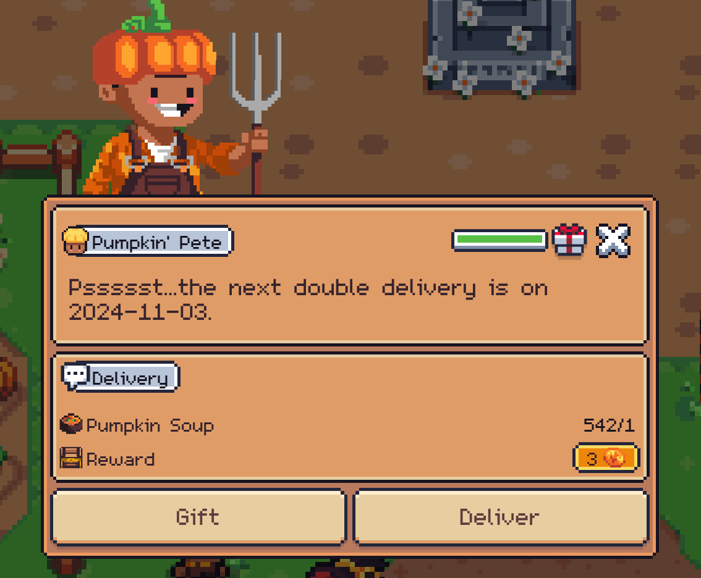

# Хэллоуин

## Как поспасть на остров?

Открываем карту и в самом низу будет остров. \
Кликаем и перемещаемся на него.&#x20;

<figure><figcaption></figcaption></figure>

## Остров

Попадая на остров можно кликнуть на доску что бы узнать о ивенте больше&#x20;

<figure><figcaption></figcaption></figure>

### Донат

Если вы задонатите более 3 Pol то после ивента получите тематический декор.&#x20;

<figure><figcaption></figcaption></figure>

### Основанная задача&#x20;

<figure><figcaption></figcaption></figure>

Основная суть ивента в том что бы набрать как можно больше очков в мини игре.&#x20;

<figure><figcaption></figcaption></figure>

Суть заключается в том что бы выжить как можно дольше тем самым набрать как больше очков. \
<mark style="color:red;">Внимание вам дается 1 попытка в день.</mark>&#x20;

#### Как выжить дольше&#x20;

* Собирайте факелы - чем больше факелом тем больше обзор
* Факелы - ваши жизни, как только факелы у вас закончатся у вас будет 10 секунд что бы найти новый.&#x20;
* Призраки и зомби - опасайтесь данных монстров они вам не друзья, при столкновении вы потеряете факелы и будете замедлены.&#x20;
* Износ - современем у вас повышается изнок ваших факелов и они гастнут быстрее.&#x20;

Если вы хотите то можете докупить попытки.&#x20;

* 3 попытки будут стоить 10 SFL
* Без лимит на день будет стоить 25 SFL

<figure><figcaption></figcaption></figure>

### Таблица лидеров

Таблица лидеров обновляется каждые 5 минут.&#x20;

<figure><figcaption></figcaption></figure>

## Награды

Пока что нет четкой информации о том какие будет награды и за какие места. \
Но нам обещают SFL и уникальные награды.&#x20;

