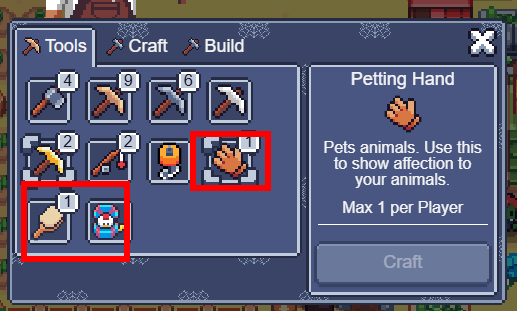

# Животные


Если вы имеете старых кур и Hen House их нужно будет продать и выкопать с своей фермы.&#x20;

Продать их можно в Обителе у Grabo. За каждую курочку вам дадут 200 монет а за курятник вернут все ресурсы.&#x20;


## Hen House&#x20;

### Уровни

* Hen House имеет **три уровня**. Каждый уровень предоставляет **+5 слотов для Куриц**.
* Изначально доступно **10 слотов**.

### **NFT  для Hen House**

#### Обновлённые NFT-бусты

* **Bale**
  * **Радиус действия**: не ограничен; эффект распространяется на всех кур в Hen House.
  * **Бонус**: теперь даёт +0.1 к сбору яиц (вместо предыдущего +0.2).
* **Gold Egg**
  * **Условие активации**: необходимо изготовить хотя бы один корм и взять его в руку для активации бонуса.
* **Chicken Coop**
  * **Бонус к яйцам**: +1 яйцо к сбору (не изменился).
  * **Увеличение количества кур**: +5 кур за каждый уровень улучшения.
* **El Pollo Veloz**
  * **Бонус**: время спячки кур уменьшено на 2 часа.

**Все остальные NFT-бусты** сохраняют свои исходные параметры и эффекты без изменений.

## Barn

### Уровни

* Barn имеет **три уровня**. Каждый уровень предоставляет **+5 слотов для животных**.
* Изначально доступно **10 слотов**.

## Магазин&#x20;

Внутри **Hen House** и **Barn** есть магазин, где можно покупать и продавать животных.&#x20;

В рамках механики **Bounties** после старта сезона игроки могут обменивать кур, овец и коров на сезонные билеты.&#x20;

**Важно**: перед продажей внимательно следите за ценами и выбирайте наиболее выгодные предложения.

## Кормление и уход

* Когда животные проголодаются, над ними появится индикатор с информацией о нужном корме.
* **Продукцию** можно получить только при повышении уровня, поэтому регулярно кормите их.&#x20;
* С каждым повышением уровня увеличивается количество собираемых ресурсов.\
  Подробнее: [https://sfl.world/info/animals](https://sfl.world/info/animals)
* С ростом уровня также возрастает вероятность, что животное может заболеть, поэтому следите за их состоянием.
* Животные после сбора впадают в спячку на 24 часа (без учёта бустов), после чего они снова становятся голодными.
* Иногда животные требуют внимания, для этого надо использовать инструменты&#x20;

<figure><figcaption></figcaption></figure>

 

<figure><figcaption></figcaption></figure>

### Мутанты

С **7 уровня** появляется шанс на получение **Мутанта**; чем выше уровень, тем выше вероятность её появления.&#x20;

## FAQ&#x20;

1. Животные просят музыкальную шкатулку но у меня её нет, что делать? \
   \- Использование инструментов не является обязательным, если вы еще не купили музыкальную шкатулку не переживайте.  Данная механика позволяет сэкономить ресурсы для получения уровня.\
   Просто дождитесь когда животное проснутся и попросит еду. &#x20;
2. Обязательно повышать уровень?  \
   \- Повышение уровня = получение продукции с животных. Если ваши животные слишком высокого уровня вы можете их продать.&#x20;
3. Животное заболело, что с ним делать? \
   \- Вы можете продать животное или вылечить его.  Учтите что игнорирование болезни увеличивает шанс заболеть для других животных.&#x20;
